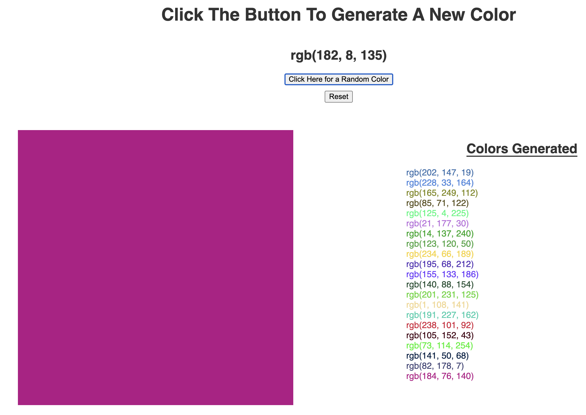

# V.2 Color_Generator

## A webpage that generates a random rgb-format color. Utilizes HTML and JS to function. 

This application is a user interactive color generator. When the user clicks the button, it generates a random color and appends it to the page on the color swab. The RBG value of the color is shown in the header and a list of the generated colors is made on the right side of the page. This way the user can generate a random color and have a history of the colors generated!

The following is a link of the deployed application: https://charanvir.github.io/Color_Generator/

Below are screenshots of the deployed application:
- 
- 
- 
